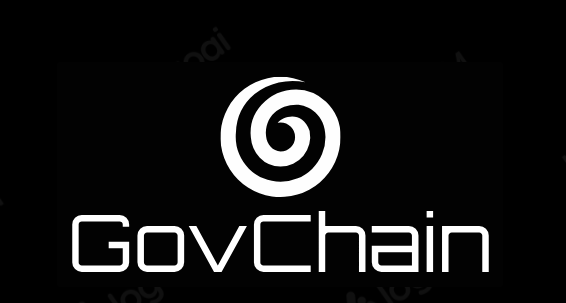
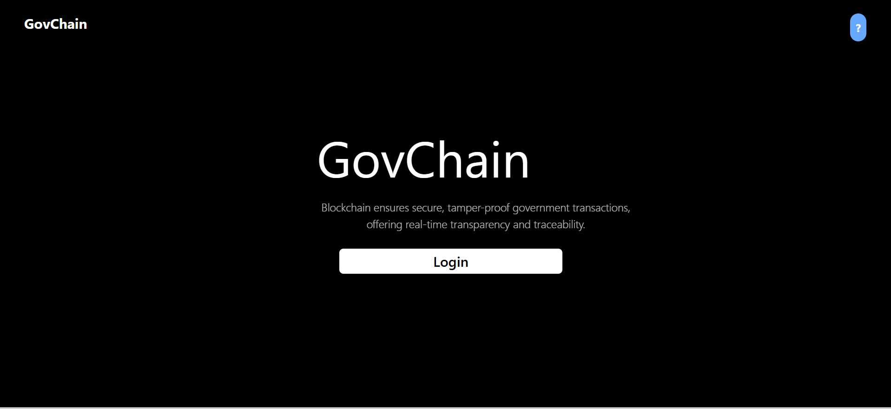
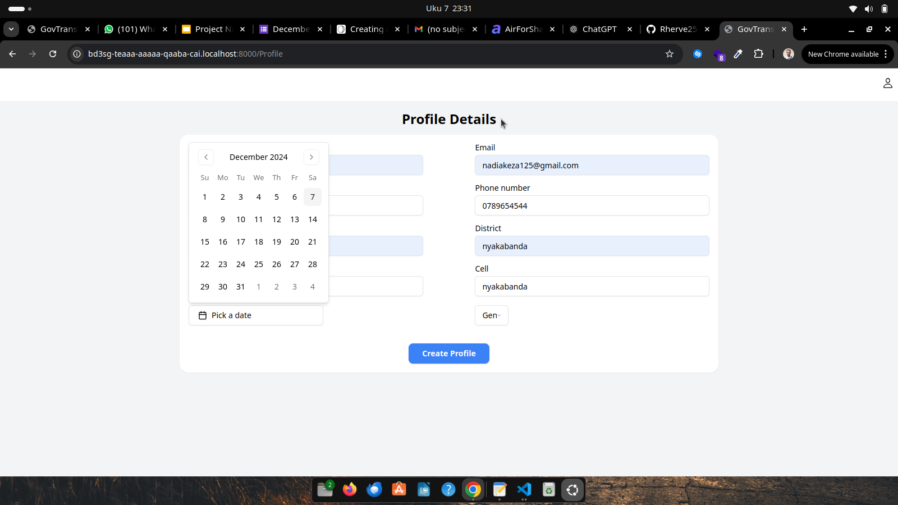
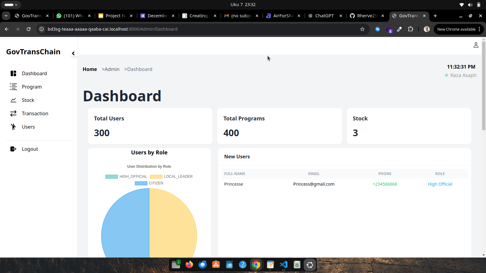
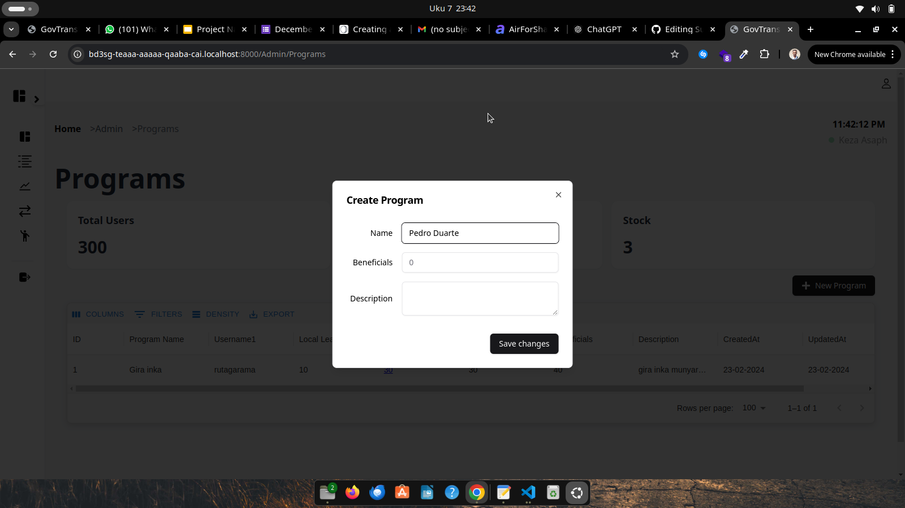

# GovChain

## Overview


GovChain is a blockchain-powered governance and distribution platform that ensures transparent, efficient, and corruption-free management of public funds, relief materials, and government incentives. By leveraging the power of decentralized technology, GovChain enables governments, private organizations, and citizens to participate in a secure, traceable, and tamper-proof ecosystem for resource distribution and tender bidding.

By leveraging blockchain technology, GovChain introduces a decentralized, secure, and verifiable method for transferring funds through various administrative levels—from national agencies to local communities and individual beneficiaries.

## Data Flow


## User Login & Profile Setup  
1. **Login with ICP Identity:**  
   - Users log in using their **ICP Identity** for secure authentication.  
2. **Profile Creation:**  
   - First-time users are redirected to a profile creation page to set up their account.  

---

## System Roles & Functionalities  

### 1. **HIGH_OFFICIAL**  

- **Program Management:**  
  - Create programs and allocate stock.  
- **Analytics and Monitoring:**  
  - View overall distribution statistics for comprehensive insights.  
- **Fund and Material Distribution:**  
  - Transfer funds and relief materials to **Local Leaders**.  
- **Program Participant Management:**  
  - Add Local Leaders to programs.  
  - Approve Citizens for program participation.  

---

### 2. **LOCAL_LEADER**  
Local Leaders facilitate the distribution process within their communities. Key features include:  
- **Citizen Admission:**  
  - Enroll Citizens into programs.  
- **Fund Distribution:**  
  - Allocate funds to approved Citizens.  
- **Material Distribution:**  
  - Distribute relief materials to program participants.  

---

### 3. **CITIZENS**  
Citizens are the beneficiaries of the platform. Key features include:  
- **Fund and Material Acceptance:**  
  - Receive funds and relief materials distributed through the system.  
- **Transaction Records:**  
  - View and track all transactions for transparency and accountability.  

---

### Prerequisites

requirements: Please install these versions or high

- **dfx**: You have installed the latest version of the DFINITY Canister SDK, `dfx`. You can download it from the DFINITY SDK page. [installation guide](https://demergent-labs.github.io/azle/get_started.html#installation)

 ```
  use version dfx 0.22.0
 ```
- **Node.js**: You have installed Node.js, version 18 or above.
```
 v20.12.2

```
- Azle version use 
 ```
  azle 0.24.1
 ```

 - podman verion use

 ```
  podman version 3.4.4
  
 ```
Please ensure all these prerequisites are met before proceeding with the setup of the project.

# Running the project locally

If you want to test your project locally, you can use the following commands:

Cloning repo:

```bash
git clone https://github.com/Rutarenzi/GovChain.git
cd GovChain
```


### to install and deploy Step by Step Follow below commands:

```bash

# Installing Dependencies
npm i

# Starts the replica, running in the background
dfx start --host 127.0.0.1:8000 --clean --background

# Deploys
dfx deploy
or

AZLE_AUTORELOAD=true dfx deploy
```

your application will be available at `http://localhost:8000?canisterId={asset_canister_id}`.
` http://{canisterId}.localhost:8000/`

* Homepage


* Onboarding


* Statistics



* High official adding program


